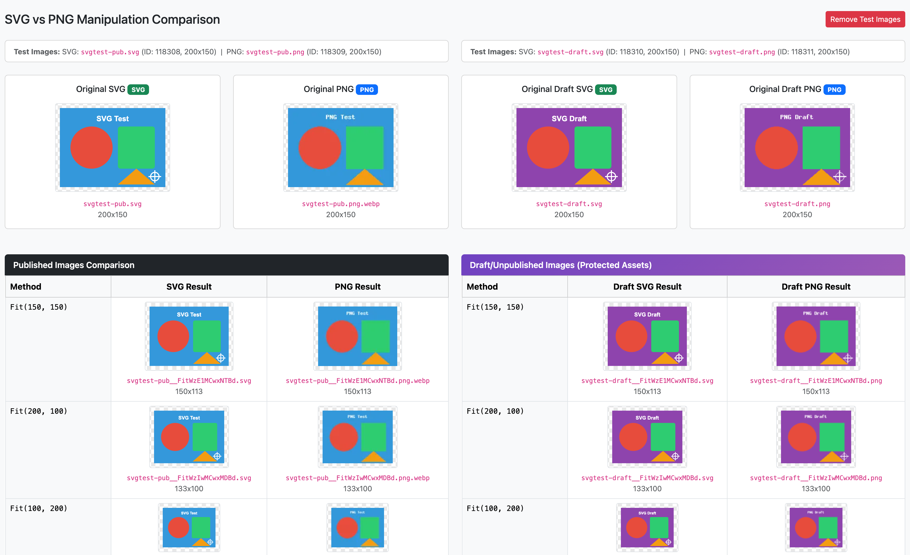

# SVG Image support for Silverstripe (assets/uploads)

This module provides comprehensive SVG support in Silverstripe's asset management system, including:

- **CMS thumbnail/preview support** for SVG files in AssetAdmin
- **Real SVG manipulation** (resize, crop) that modifies viewBox/dimensions while preserving vectors
- **SVG sanitization** on upload to remove potentially dangerous content
- **Dimension parsing** from SVG viewBox/width/height attributes
- **Automatic class handling** for SVGs uploaded through Image relations

## Version Compatibility

| Branch | Module Version | Silverstripe | PHP |
|--------|----------------|--------------|-----|
| `main` | `2.x` | ^6.0 | ^8.3 |
| `1` | `1.x` | ^4.0 \|\| ^5.0 | ^7.4 \|\| ^8.0 |
| `0` | `0.x` | ~3.7 | ^5.6 \|\| ^7.0 |

**Note:** `composer.json` is the source of truth for exact version constraints.

## How it works

The module configures Silverstripe to use the `SVGImage` class for `.svg` files via `class_for_file_extension`. This happens automatically for files uploaded through AssetAdmin.

### SVG uploads through Image relations

When uploading SVGs through relation fields (`has_one`, `has_many`, or `many_many` to `Image`), Silverstripe's ORM enforces the relation's class type, ignoring the `class_for_file_extension` config. This module includes `SVGImageExtension` which automatically corrects the `ClassName` to `SVGImage` after the file is written.

This happens transparently - no configuration needed.

### SVG Manipulation

Unlike raster images, SVG manipulation preserves the vector format by modifying viewBox and width/height attributes. The module uses [contao/imagine-svg](https://github.com/contao/imagine-svg) for manipulation.

**Core operations** (always available):
- `Fit($width, $height)` - Resize to fit within bounds, maintaining aspect ratio
- `FitMax($width, $height)` - Same as Fit, but only if image is larger
- `Fill($width, $height)` - Crop and resize to fill exact dimensions
- `FillMax($width, $height)` - Same as Fill, but only if image is larger
- `Pad($width, $height)` - Fit within bounds and add transparent padding to reach exact dimensions
- `ScaleWidth($width)` - Scale to specific width, maintaining aspect ratio
- `ScaleHeight($height)` - Scale to specific height, maintaining aspect ratio
- `ScaleMaxWidth($width)` - Scale to max width, only if larger
- `ScaleMaxHeight($height)` - Scale to max height, only if larger
- `Resampled()` - Returns the SVG unchanged (for compatibility with Image templates)

Manipulated SVGs are stored as variants (just like raster image variants), so they're cached and only generated once.

To disable manipulation and return original SVGs unchanged (legacy behavior):

```yaml
Restruct\Silverstripe\SVG\SVGImage:
  enable_svg_manipulation: false
```

### Optional Extensions

This module provides optional extensions that are automatically applied when their corresponding modules are installed:

#### Crop Support (requires `restruct/silverstripe-focuspointcropper`)

When the FocusPointCropper module is installed, these additional methods become available:

- `CropRegion($x, $y, $width, $height)` - Crop to specific region
- `CropWidth($width)` - Crop to width using CropData
- `CropHeight($height)` - Crop to height using CropData
- `applyCropData($cropDataJson)` - Apply CMS-defined crop data

#### FocusPoint Support (requires `jonom/focuspoint`)

When the FocusPoint module is installed, these additional methods become available:

- `FocusFill($width, $height)` - Fill with focus-aware cropping
- `FocusFillMax($width, $height)` - Same as FocusFill, but only if image is larger
- `FocusCropWidth($width)` - Crop to width, centered on focus point
- `FocusCropHeight($height)` - Crop to height, centered on focus point

### SVG Sanitization

SVG files are automatically sanitized on upload using [enshrined/svg-sanitize](https://github.com/enshrined/svg-sanitize). This removes potentially dangerous content like:
- JavaScript/event handlers
- External references (can be disabled)
- PHP tags
- Other XSS vectors

Configuration options:

```yaml
Restruct\Silverstripe\SVG\SVGImage:
  # Disable sanitization (not recommended)
  sanitize_on_upload: false

  # Keep remote references (disabled by default for security)
  sanitize_remove_remote_references: false
```

### Migrating existing SVG files

If you have existing SVG files in your database that were uploaded before installing this module, enable auto-migration:

```yaml
Restruct\Silverstripe\SVG\SVGImage:
  auto_migrate_svg_class: true
```

Then run `dev/build`. The migration will update the `ClassName` in `File`, `File_Live`, and `File_Versions` tables (including files with NULL or empty ClassName).

> **Note:** The migration runs via `requireDefaultRecords()`. If you use `dev/build no-populate=1`, the migration will be skipped. Run `dev/build/defaults` separately to trigger it, or run a normal `dev/build` without `no-populate`.

## Usage in templates

```html
<!-- Basic usage -->


<!-- With manipulation (preserves vector format) -->


<!-- Responsive example -->


<!-- Works in mixed image/SVG contexts -->


<!-- FocusPoint methods (when jonom/focuspoint is installed) -->

```

### Inline SVG

```html
<!-- Add raw SVG inline -->
{$Image.SVG_RAW_Inline}

<!-- Conditional based on file type -->
<% if $Image.IsSVG %>
  {$Image.SVG_RAW_Inline}
<% else %>
  
<% end_if %>
```

### Inline SVG with color manipulation

If you need to manipulate SVG colors or add CSS classes for inline SVGs, consider [stevie-mayhew/silverstripe-svg](https://github.com/stevie-mayhew/silverstripe-svg). You can use it alongside this module by passing the asset path:

```html
{$SVG($Image.Filename).fill('#FF9933').extraClass('my-icon')}
```

## SVG Security

SVGs can expose attack vectors comparable to HTML/JS. This module mitigates risks through automatic sanitization, but you should still:

- Only accept SVG uploads from trusted users
- Use `` tags rather than inline SVG when possible (provides more browser security)
- Keep the sanitization enabled (default)

For more information on SVG security risks, see [OWASP SVG Security Cheat Sheet](https://cheatsheetseries.owasp.org/cheatsheets/SVG_Security_Cheat_Sheet.html).

## Configuration reference

```yaml
Restruct\Silverstripe\SVG\SVGImage:
  # Enable real SVG manipulation (resize/crop)
  enable_svg_manipulation: true

  # Sanitize SVGs on upload
  sanitize_on_upload: true

  # Remove remote references during sanitization
  sanitize_remove_remote_references: true

  # Auto-migrate existing SVG files on dev/build
  auto_migrate_svg_class: false
```

## Development Tools

### SVG vs PNG Comparison Tool

A visual comparison tool is available at `/dev/svg-compare` to verify that SVG manipulations behave consistently with PNG manipulations.



The tool:
- Compares all manipulation methods (Fit, Fill, Pad, Scale, etc.) side-by-side for SVG and PNG
- Tests both published and draft/protected assets
- Shows FocusPoint methods when `jonom/focuspoint` is installed
- Includes bundled test images or accepts custom image IDs
- Displays badges and legends explaining each manipulation type

### Clear SVG Variants Task

To clear all generated SVG variant files (useful after upgrading or when manipulation settings change):

```bash
# Dry run - shows what would be deleted
vendor/bin/sake dev/tasks/ClearSVGVariantsTask

# Actually delete variants
vendor/bin/sake dev/tasks/ClearSVGVariantsTask confirm=1

# Verbose output
vendor/bin/sake dev/tasks/ClearSVGVariantsTask confirm=1 verbose=1
```

Variants will be regenerated on next request using the current manipulation settings.
